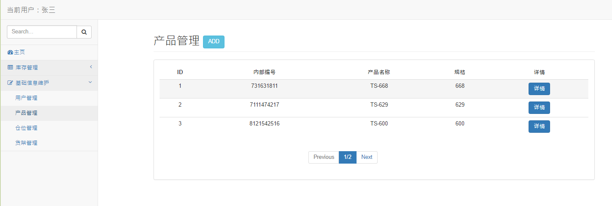
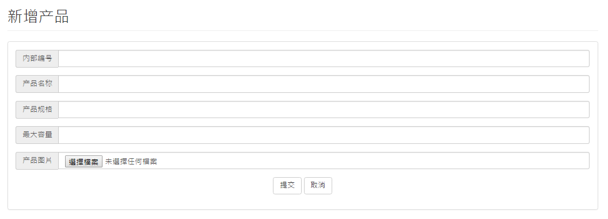
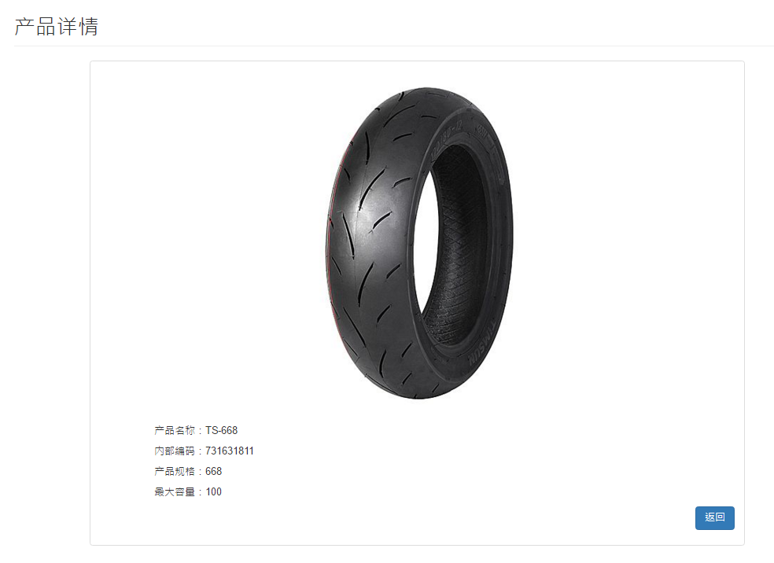
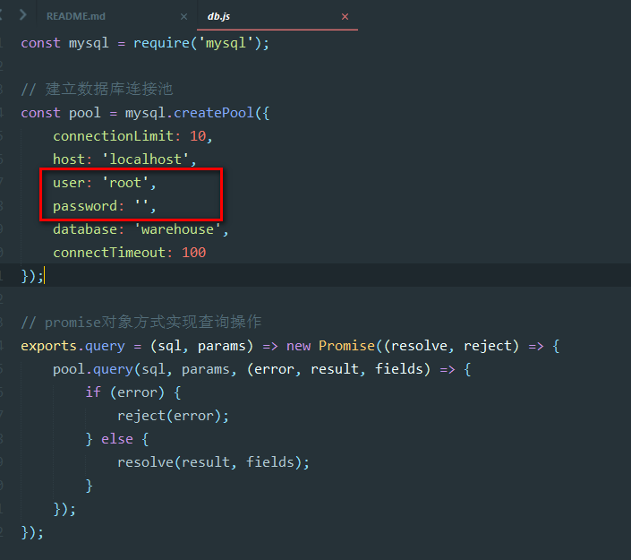

# FollowMe物流追溯系统-简化版-后台部分

# 相关工具

- 包管理：npm
- 框架：
  + 移动端 -- ionic、cordova、ngCordova
  + PC端   -- mysql、express、angular、nodejs、

# 业务简介

- 公司主要产品轮胎

- 业务流程；
	1.加工车间生产完成的轮胎，用货架（不同规格的轮胎，一架能容纳的数量不同）送至包装车间的待包装区；包装课长根据订单和发货安排，进行包装排班（实际流程中，同一轮胎针对客户区分包装，此处简化处理）
	2.包装过程，先用打包带包装每一条胎，5条胎塑封为一捆（不同客户塑封需求不同，有的要求10条一捆，有的客户不需要打捆），放到另外的货架上，不同规格的轮胎，货架能存放的上限不同，需要单独设置，
	3.包装时每一条胎的外包装贴一个条码，每5条打一捆，粘贴一个捆标签，捆条码和单条的条码是预先生成并绑定好的，货架存放多捆轮胎

# 程序基本功能：

- 库存管理
  + 入库单审核
  + 库存查询

- 基础信息维护
  + 用户管理
  + 产品管理
  + 仓位管理
  + 货架管理

Tips：
作为demo，仅实现了基本的登录验证，登录信息保存，基础信息的查询功能
产品管理部分，实现了分页查询、添加新产品（包含图片上传）、产品详情

# Have a try

安装MySQL数据库，执行 myBack/datebase/warehouse.sql
修改 models\db.js 文件，将user/password 修改为你的数据库账户和密码

打开命令行，进入myBack文件夹，运行  $node app
访问： http://localhost:3000/account/login
用户名： zhangsan  密码：123456

# 数据结构

## 产品 products
- 编号：id
- 产品编号*：product_number
- 产品名称*：product_name
- 规格*：product_size
- 最大存放数量*：capacity
- 图片：picture

## 货架 shelfs
- 编号：id
- 货架名称*: shelf_number
- 状态：status

## 仓位 positions
- 编号：id
- 仓位名称*：position_number
- 状态：status

## 员工信息 users
- 编号：id
- 用户名*: username
- 密码*：password
- 真实姓名*：realname
- 邮箱、电话：略

## 入库单 receipts
- 编号：id
- 单号：receipt_id
- 入库日期：receipt_date
- 制单人：maker
- 班组（甲/乙/丙）：team
- 生产日期：product_date
- 产品编号: product_id
- 产品数量：count
- 货架编号: shelf_id
- 仓位编号: position_id
- 状态（是否通过审核）：status

- 仓库编号：略
- 入货仓库：略

## 二维码编码表 codes
- 编号：id
- 编码: code_number
- 上级编码：p_code
- 状态：status

## 产品-货架 shelf_product
- 编号：id
- 产品编号: product_id
- 货架编号: shelf_id
- 状态：status

## 货架-仓位 shelf_position (简化模型,略)
- 编号：id
- 货架编号: shelf_id
- 仓位编号: position_id

## 机构（仓库） warehouse (简化模型,略)
- 编号：id
- 机构名称*（仓库）：w_name
- 内部编号*：w_number
- 上级机构*：parent_id
- 其他信息：（区域信息、账户信息、地址等）：略
